

## VQGAN

[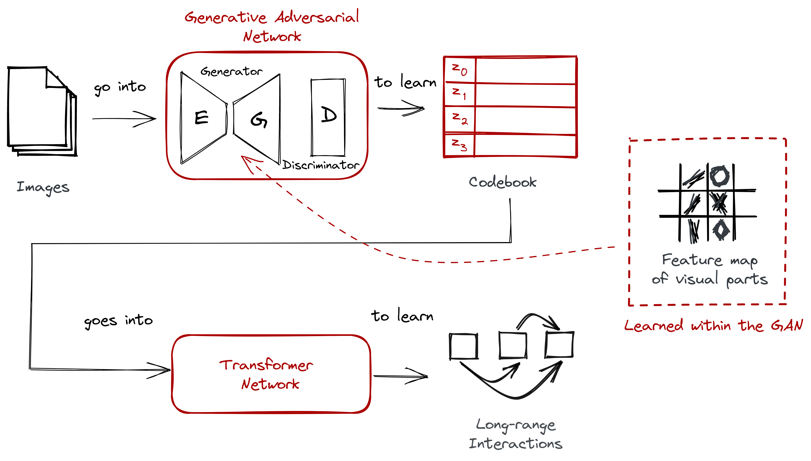](https://ljvmiranda921.github.io/notebook/2021/08/08/clip-vqgan/)

1.  A raw image `\(x\in \mathbb{R}^{H\times W\times 3}\)` serves as input to the model.

2.  The image runs through an CNN-based image encoder `\(E\left( \cdot \right)\)` to produce the latent variable `\(\hat{z}=E\left( x \right)\in \mathbb{R}^{h\times w\times n_z}\)` which summarizes local image patches. Hence, the encoder is designed to exploit strong local, position-invariant correlations within images.

3.  The CNN representation `\(\hat{z}\)` is quantized using an element-wise compression module `\(\textbf{q}\left( \cdot \right)\)` per `\(\hat{z}_{ij}\)` to obtain a quantized image encoding:

    $$
    z_\textbf{q} =\textbf{q}\left( \hat{z}  \right):=\left( arg \min_{\substack{z_k\in }}\mathcal{Z} \left\| \hat{z}_{ij}-z_k \right\|\right)\in \mathbb{R}^{h\times w\times n_z}
    $$

    Thereby, each `\(\hat{z}_{ij}\in\hat{z}\)` is mapped into its closest codebook entry `\(z_k\)` (i.e., nearest neighbour) which stems from a learned discrete *codebook* `\(\mathcal{Z}=\left\{ z_k \right\}_{k=1}^{K}\subset \mathbb{R}^{n_z}\)` with the hyperparameters `\(n_z\)` denoting the dimensionality of the codebook and `\(h\times w\)` as the number of codebook token. Each codebook entry represents a cluster centroid in latent space that is optimized during training. Generally, the smaller the codebook size the more abstract the learned visual parts. This leads to a potentially more creative but less controllable generator through a higher degree of interpolation.

    [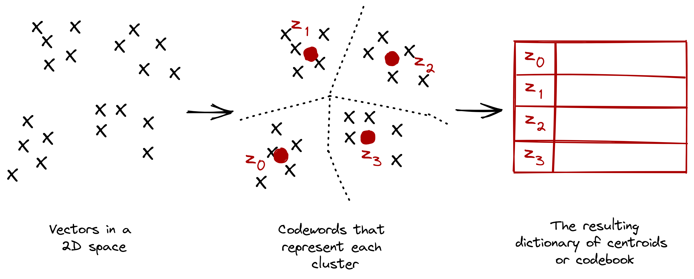](https://ljvmiranda921.github.io/notebook/2021/08/08/clip-vqgan/)

    Equivalently, `\(z_\textbf{q}\)` can, hence, be representend in terms of a sequence of codebook indices which act as input token:

    $$
    z_\textbf{q} = \left( z_{s_{ij}} \right)
    $$

    with `\(s_{ij}\)` denoting the respective codebook entry indexes which form the sequence `\(s\in\left\{ 0,..., \left| \mathcal{Z} \right|-1 \right\}^{h\times w}\)`.

4.  The image is reconstructed from the codebook vectors (i.e., quantized image) via a generator `\(G\left( \cdot \right)\)` (which is trained in an adversarial fashion by trying to outwit a patch-based discriminator `\(D\left( \cdot \right)\)`):

    $$
    \hat{x}=G\left( z_\textbf{q} \right)=G\left( \textbf{q}\left( E\left( x \right) \right) \right)
    $$

5.  Finally, three losses are back-propagated through the network. First, the compression module is trained to learn a rich codebook:

    $$
    \mathcal{L}\_{VQ}\left( E,G,\mathcal{Z} \right) =
    \left\| x-\hat{x} \right\|^{2} +
    \left\| sg\left[ E\left( x \right) -z_\textbf{q} \right] \right\|^2_2 +
    \left\| sg\left[ z_\text{q} -E\left( x \right) \right] \right\|^2_2
    \tag{1}
    $$
    
    where the first term on the RHS describes the *reconstruction loss*, the second term facilitates the learning of meaningful embeddings, and the latter term is the *commitment loss*.

    Second, the GAN is learned under the classic adversarial training framework:

    $$
    \mathcal{L}\_{GAN}\left( \left\\{ E,G,\mathcal{Z} \right\\}, D \right)=
    \left[ \log D\left( x \right) + 1-\log D\left( \hat{x} \right) \right]
    \tag{2}
    $$

    Both are combined into the overall VQGAN loss using an adaptive weight `\(\lambda\)`:

    $$
    arg \min_{\substack{E,G,\mathcal{Z}}} \max_{\substack{D}} \mathbb{E}\_{x\sim  p\left( x \right)}=
    \mathcal{L}\_{VQ}\left( E,G,\mathcal{Z} \right)+\lambda
    \mathcal{L}\_{GAN}\left( \left\\{ E,G,\mathcal{Z} \right\\}, D \right)
    \tag{1+2}
    $$

    Third, an autoregresive Transformer model is concurrently trained to perform next-index prediction to model the next codebook entry in a sequence of entry indexes under the following loss function:

    $$
    \mathcal{L_{Transformer}}=
    \mathbb{E}_{x\sim  p\left( x \right)}\left[ -\log p\left( s \right) \right]=
    \mathbb{E}\_{x\sim  p\left( x \right)}\left[ -\log  \right]
    \tag{3}
    $$

    with `\(p\left( s \right)=\prod_i p\left( s_i | s_{\lt i} \right)\)`. This way, the Transformer learns long-range dependencies between visual parts and, thus, the the global composition of the image.

    Alternatively, the synthesis process can be conditioned on additional information (e.g., class information) by concatenating with a conditioning embedding `\(c\)`, i.e., `\(p\left( s|c \right)=\prod_i p\left( s_i | s_{\lt i},c \right)\)`. The Transformer employs sliding-window attention to enable the generation of high resolution images at the caveat of only paying attention to a local (but still sufficiently large) set of codebook vectors.

    [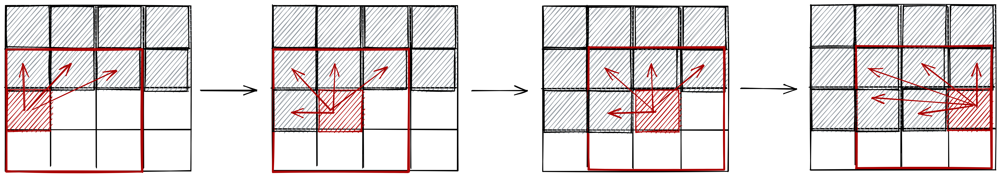](https://ljvmiranda921.github.io/notebook/2021/08/08/clip-vqgan/)

## CLIP

[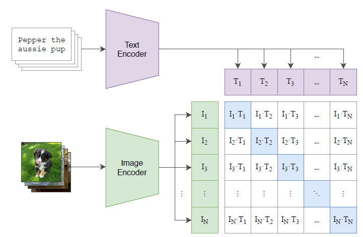](https://arxiv.org/abs/2103.00020)

1.  A (desirably large) batch of image-text-pairs serve as input to CLIP. Pairs are gleaned and filtered from publicly available sources on the Internet, resulting in a dataset comprising of a total of 400 million image-text-pairs. In contrast to most computer vision models, the image captions provide a natural language signal richer than any single class label and are, thus, less restrictive in terms of supervision (*natural language supervision*).

2.  Text and images run through a text and image encoder, respectively. The former is a bi-directional 12-layer Transformer while the latter is either a ResNet or Vision Transformer (ViT). The most prominent VQGAN-CLIP framework employs a ViT/B-32 which models 2D images in terms of embedded 32x32 image patches which serve as 1D input to vanilla Transformer encoder (in conjunction with positional embeddings).

    Image captions are capped at 76 token with the `EOS` token of the final hidden layer representing the dense text embedding.

3.  The text and image embeddings are projected into a multi-model embedding space in which pairwise Cosine similarities scores quantify the match between each text and image embedding included in each batch.

4.  The model is optimized to produce a high-quality, multi-modal embedding space in which embeddings of actual (randomly matched) image-text-pairs are in close proximity to each other (far apart). The authors frame this pre-training task by asking "which captions goes with which image?"

## Inference-by-Optimization

[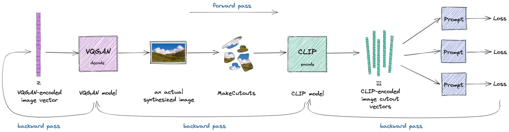](https://alexasteinbruck.medium.com/explaining-the-code-of-the-popular-text-to-image-algorithm-vqgan-clip-a0c48697a7ff)

1.  Encode text prompt using CLIP's pre-trained text encoder.

2.  Create noise vector `\(\hat{z}\)` which serves as input to the pre-trained VQGAN model. The model's decoder initiates the synthesis process by generating an image candidate that is to be evaluated by CLIP. Alternatively, `\(\hat{z}\)` can be initialized set by providing a preexisting image as prior which is encoded by the VQGAN model. This way, the image synthesis does not start from random noise (*cold start*) but rather from a given image (*warm start*) which may inhibit desired properties of the output image.

3.  Encode the synthesized image using CLIP's pre-trained image encoder. Importantly, prior to encoding, the image is segmented into a batch of random *cutouts* as CLIP operates on lower resolution images relative to VQGAN. In addition, the synthesized image faces various augmentations, such as flipping, color jitter, or noising.

4.  Compute similarity between embedded text prompt and synthesized image cutouts within CLIP's multi-modal embedding space.

5.  "Optimize" `\(\hat{z}\)` using back-propagation with the text-image-similarity score acting as a loss function that is to be maximized (*gradient ascent*). The loss is computed by averaging over all crops and augmented images to stabilize the update steps. Finally, the loss is extended by a regularization loss to penalize the appearance of visual artefacts:

    $$
    \mathcal{L}\_{VQGAN-CLIP}=\mathcal{L}\_{CLIP}+\alpha\times \frac{1}{N}\sum_{i=0}^{N} Z_i^2
    $$
    
    Mostly, optimization over 500 update steps yields stable and visually appealing results.

## Experiments

  
Code Implementation

  ×
  

    
All experiments were conducted using Google Colab. The code is based on the seminal <a href="https://docs.google.com/document/d/1Lu7XPRKlNhBQjcKr8k8qRzUzbBW7kzxb5Vu72GMRn2E">Juypter Notebook</a> disseminated by <a href="https://github.com/crowsonkb">Katherine Crowson</a>. Click <a href="vqgan-clip-image-synthesis.ipynb" download><svg width="15" height="15" xmlns="http://www.w3.org/2000/svg" viewBox="0 0 512 512"><path d="M480 352h-133.5l-45.25 45.25C289.2 409.3 273.1 416 256 416s-33.16-6.656-45.25-18.75L165.5 352H32c-17.67 0-32 14.33-32 32v96c0 17.67 14.33 32 32 32h448c17.67 0 32-14.33 32-32v-96C512 366.3 497.7 352 480 352zM432 456c-13.2 0-24-10.8-24-24c0-13.2 10.8-24 24-24s24 10.8 24 24C456 445.2 445.2 456 432 456zM233.4 374.6C239.6 380.9 247.8 384 256 384s16.38-3.125 22.62-9.375l128-128c12.49-12.5 12.49-32.75 0-45.25c-12.5-12.5-32.76-12.5-45.25 0L288 274.8V32c0-17.67-14.33-32-32-32C238.3 0 224 14.33 224 32v242.8L150.6 201.4c-12.49-12.5-32.75-12.5-45.25 0c-12.49 12.5-12.49 32.75 0 45.25L233.4 374.6z"/></svg></a> to download the adapated Notebook.

  

### Delicious Choclate Bar Made of < material > | ArtStation HD

<table>
  <tr>
    <td>
      <figure>
        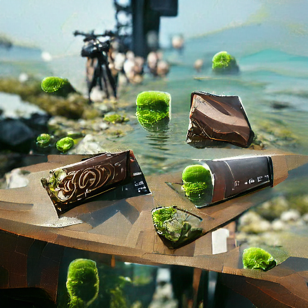
        <figcaption>concept art</figcaption>
      </figure>
    </td>
    <td>
      <figure>
        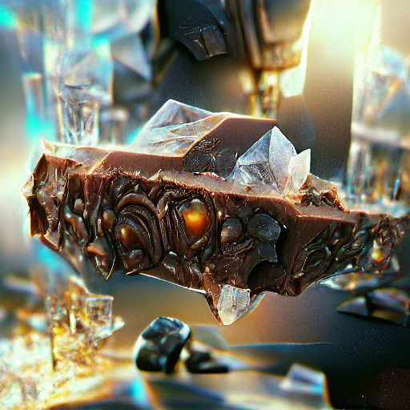
        <figcaption>crystalline matter  </figcaption>
      </figure>
    </td>
    <td>
      <figure>
        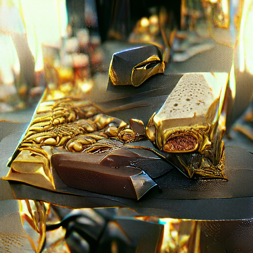
        <figcaption>gold</figcaption>
      </figure>
    </td>
    <td>
      <figure>
        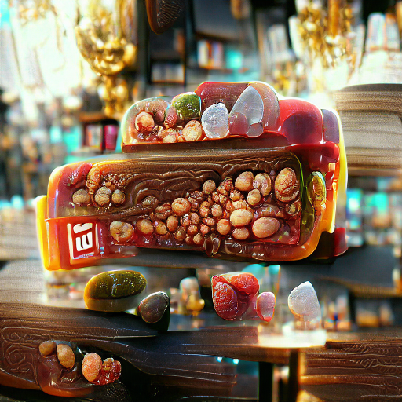
        <figcaption>jellies and peanuts</figcaption>
      </figure>
    </td>
  </tr>
  <tr>
    <td>
      <figure>
        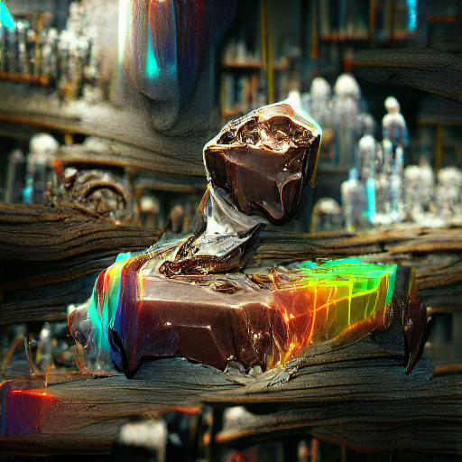
        <figcaption>spectral matter</figcaption>
      </figure>
    </td>
    <td>
      <figure>
        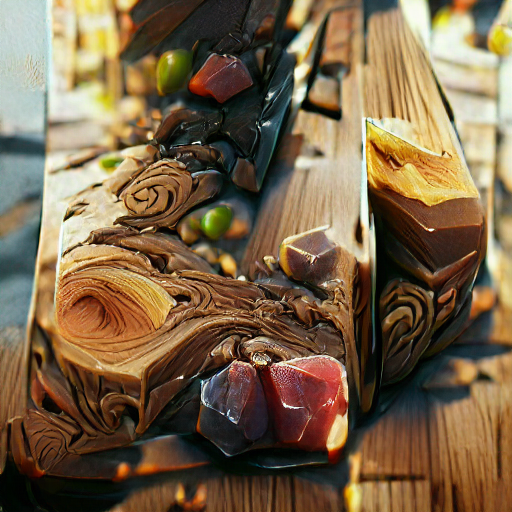
        <figcaption>wood</figcaption>
      </figure>
    </td>
    <td>
      <figure>
        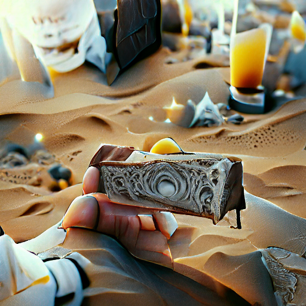
        <figcaption>moon sand</figcaption>
      </figure>
    </td>
  </tr>
</table>

### Wooden Banana Temple in an Underwater Kingdom | < art style >

<table>
  <tr>
    <td>
      <figure>
        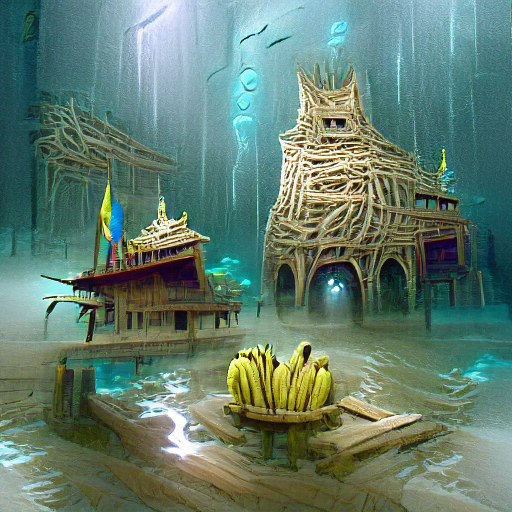
        <figcaption>concept art</figcaption>
      </figure>
    </td>
    <td>
      <figure>
        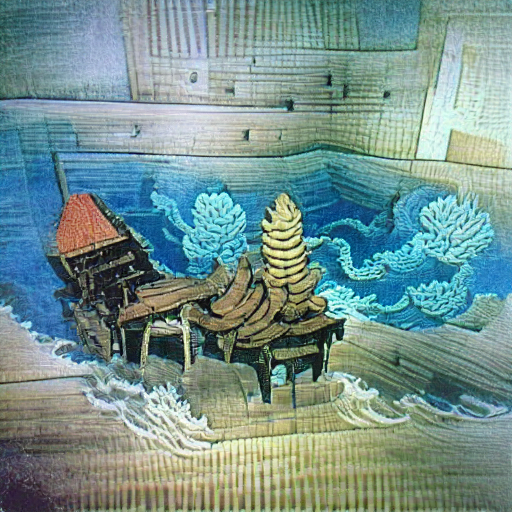
        <figcaption>painting by Hokusai</figcaption>
      </figure>
    </td>
    <td>
      <figure>
        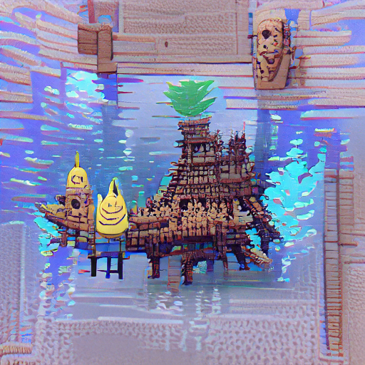
        <figcaption>pixelart</figcaption>
      </figure>
    </td>
    <td>
      <figure>
        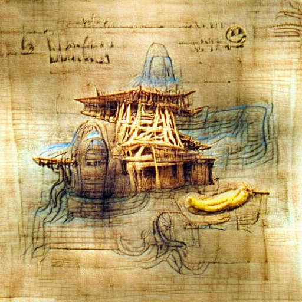
        <figcaption>sketch by Leonardo Da Vinci</figcaption>
      </figure>
    </td>
  </tr>
  <tr>
    <td>
      <figure>
        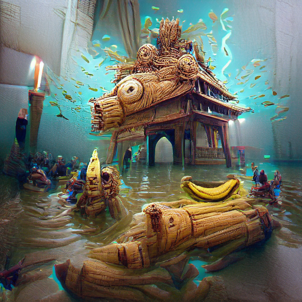
        <figcaption>trending on artstation</figcaption>
      </figure>
    </td>
    <td>
      <figure>
        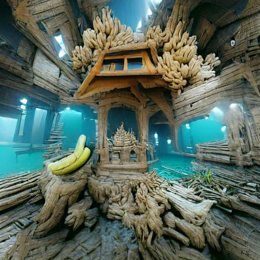
        <figcaption>unreal engine</figcaption>
      </figure>
    </td>
    <td>
      <figure>
        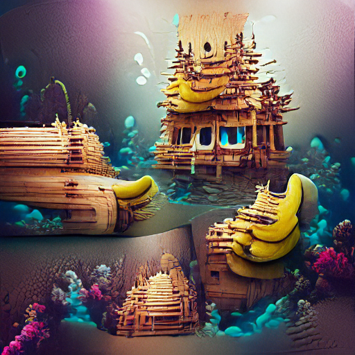
        <figcaption>Behance HD</figcaption>
      </figure>
    </td>
    <td>
      <figure>
        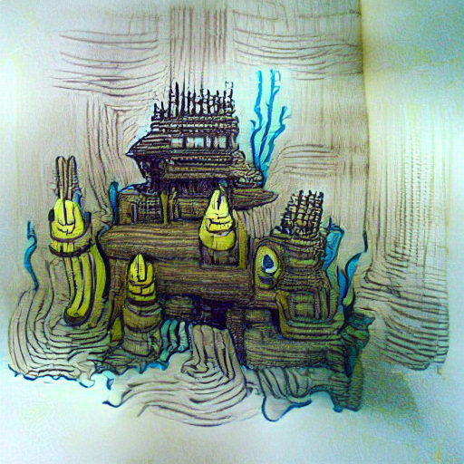
        <figcaption>ink drawing</figcaption>
      </figure>
    </td>
  </tr>
  <tr>
    <td>
      <figure>
        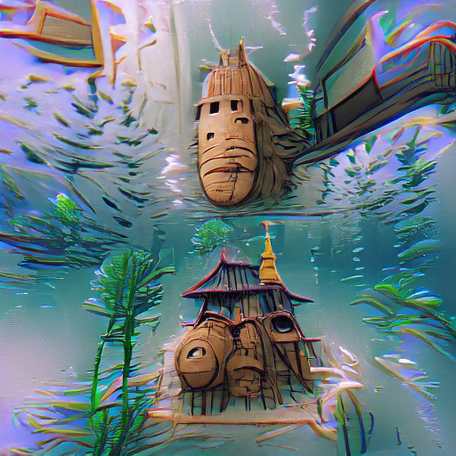
        <figcaption>Studio Ghibli style</figcaption>
      </figure>
    </td>
    <td>
      <figure>
        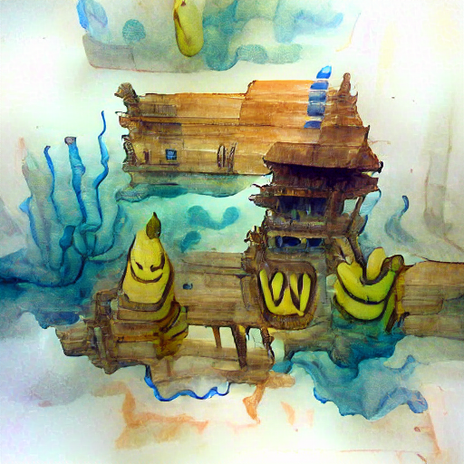
        <figcaption>watercolour</figcaption>
      </figure>
    </td>
    <td>
      <figure>
        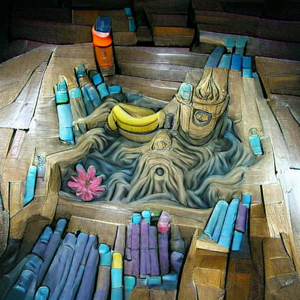
        <figcaption>chalk art"</figcaption>
      </figure>
    </td>
    <td>
      <figure>
        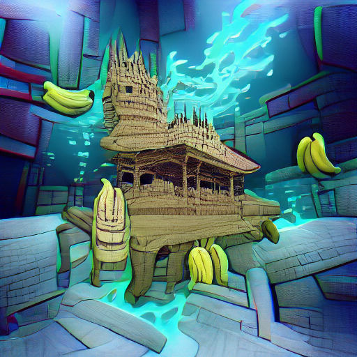
        <figcaption>cel shading</figcaption>
      </figure>
    </td>
  </tr>
  <tr>
    <td>
      <figure>
        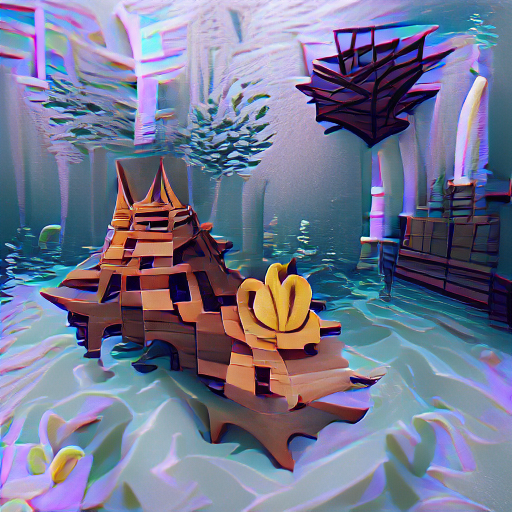
        <figcaption>low poly</figcaption>
      </figure>
    </td>
    <td>
      <figure>
        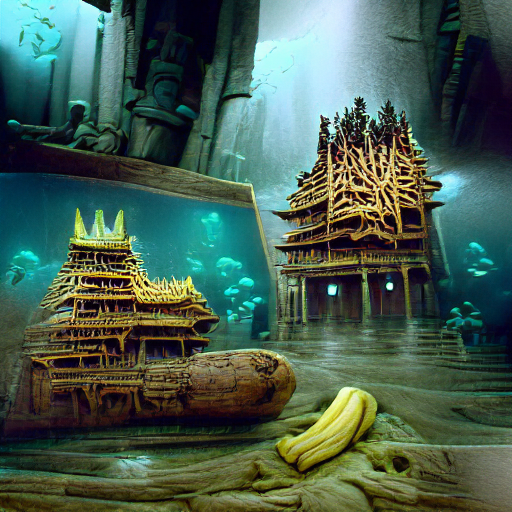
        <figcaption>matte painting</figcaption>
      </figure>
    </td>
    <td>
      <figure>
        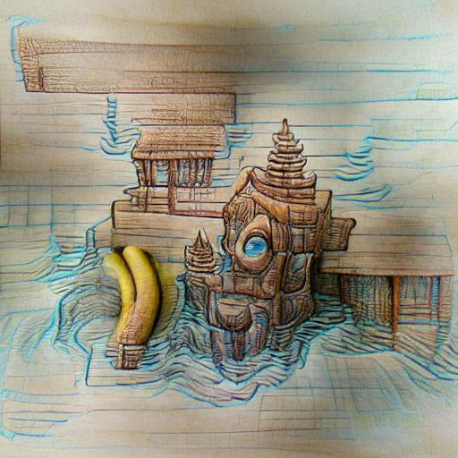
        <figcaption>pencil sketch</figcaption>
      </figure>
    </td>
    <td>
      <figure>
        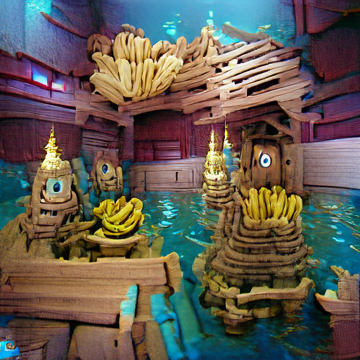
        <figcaption>disney style</figcaption>
      </figure>
    </td>
  </tr>
  <tr>
    <td>
      <figure>
        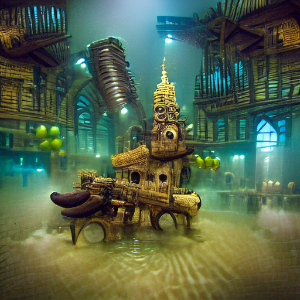
        <figcaption>steampunk</figcaption>
      </figure>
    </td>
    <td>
      <figure>
        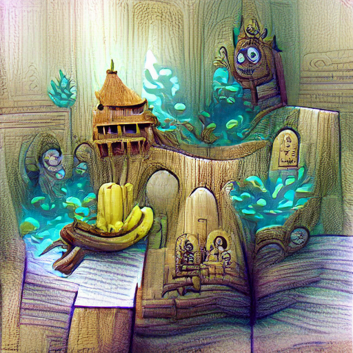
        <figcaption>storybook illustration</figcaption>
      </figure>
    </td>
    <td>
      <figure>
        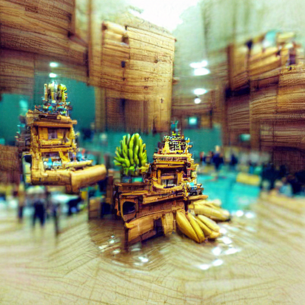
        <figcaption>tilt shift</figcaption>
      </figure>
    </td>
    <td>
      <figure>
        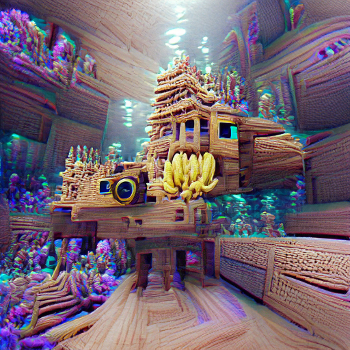
        <figcaption>8K 3D</figcaption>
      </figure>
    </td>
  </tr>
</table>

<table
  <tr>
    <td>
      <video width="100%" controls>
        <source src="gallery/wooden-banana-temple/video-wooden-banana-temple-in-an-underwater-kingdom_trending-on-artstation.mp4" type="video/mp4">
      </video>
    </td>
    <td>
      <video width="100%" controls>
        <source src="gallery/wooden-banana-temple/video-wooden-banana-temple-in-an-underwater-kingdom-steampunk.mp4" type="video/mp4">
      </video>
    </td>
  </tr>
</table>

### Marble Temple in the Volcanic Highlands | < art style >

<table>
  <caption><b>Image Prompt</b></caption>
  <tr>
    <td>
      <figure>
        
        <figcaption>trending on artstation</figcaption>
      </figure>
    </td>
    <td>
      <figure>
        
        <figcaption>steampunk</figcaption>
      </figure>
    </td>
  </tr>
</table>

<table>
  <caption><b>Model Output</b></caption>
  <tr>
    <td>
      <figure>
        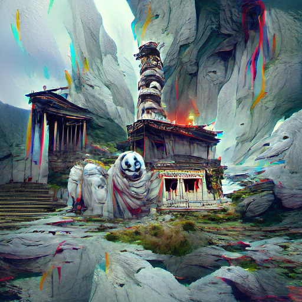
        <figcaption>trending on artstation</figcaption>
      </figure>
    </td>
    <td>
      <figure>
        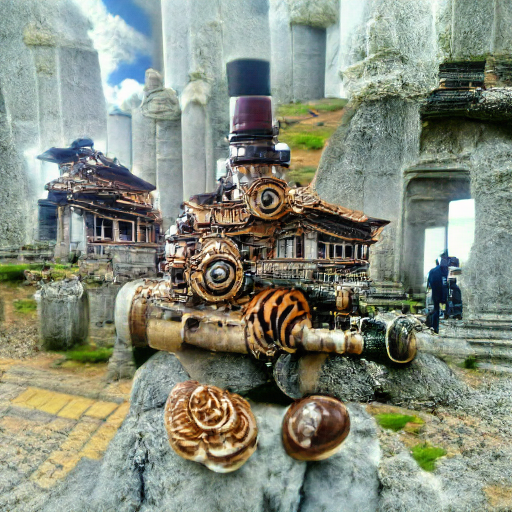
        <figcaption>steampunk</figcaption>
      </figure>
    </td>
  </tr>
</table>

### Marble Temple in the Volcanic Highlands | < art style >

<table>
  <caption><b>Image Prompt</b></caption>
  <tr>
    <td>
      <figure>
        <a href="https://s3.voyapon.com/wp-content/uploads/sites/4/2021/01/03200144/Vulkane_10-1024x682.jpg">
        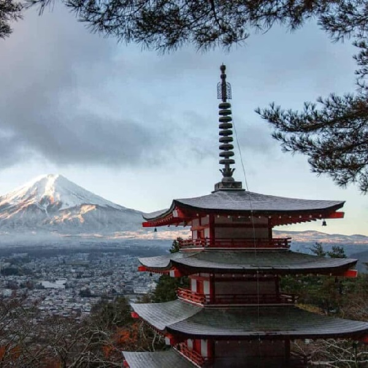</a>
      </figure>
    </td>
    <td>
      <figure>
        
      </figure>
    </td>
  </tr>
</table>

<table>
  <caption><b>Model Output</b></caption>
  <tr>
    <td>
      <figure>
        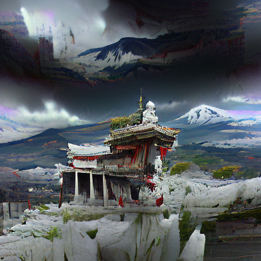
        <figcaption>trending on artstation</figcaption>
      </figure>
    </td>
    <td>
      <figure>
        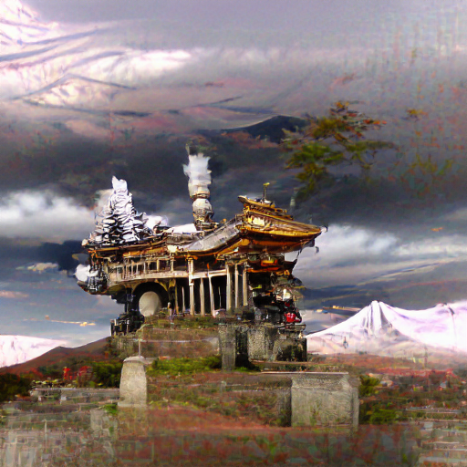
        <figcaption>steampunk</figcaption>
      </figure>
    </td>
  </tr>
</table>

### Logo Generation

<table>
  <caption><b>Image Prompt</b></caption>
  <tr>
    <td>
      <figure>
        
      </figure>
    </td>
    <td>
      <figure>
        
      </figure>
    </td>
  </tr>
</table>

<table>
  <caption><b>Model Output</b></caption>
  <tr>
    <td>
      <figure>
        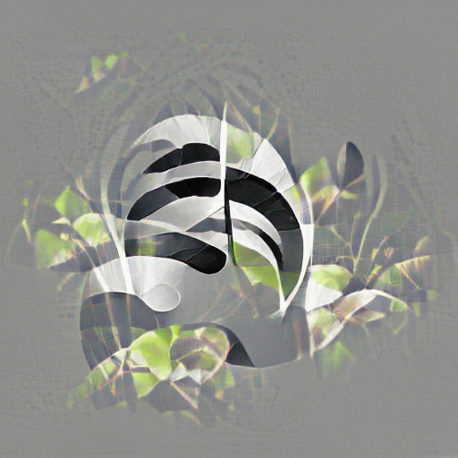
        <figcaption>black-and-white | nature-lover</figcaption>
      </figure>
    </td>
    <td>
      <figure>
        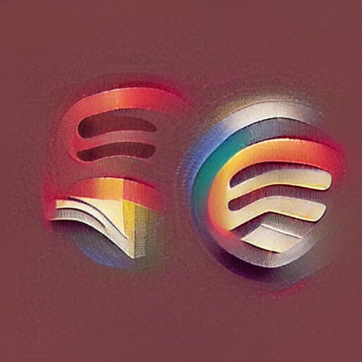
        <figcaption>colorful | style-of-1970s-sci-fi-book-cover</figcaption>
      </figure>
    </td>
  </tr>
    <tr>
    <td>
      <figure>
        
        <figcaption>colorful | nature-lover</figcaption>
      </figure>
    </td>
    <td>
      <figure>
        
        <figcaption>colorful | trending-on-artstation</figcaption>
      </figure>
    </td>
  </tr>
</table>

<table
  <tr>
    <td>
      <video width="100%" controls>
        <source src="gallery/logo-generation/colorful-company-logo-of-nature-lover_targeted.mp4" type="video/mp4">
      </video>
    </td>
    <td>
      <video width="100%" controls>
        <source src="gallery/logo-generation/colorful-company-logo-trending-on-artstation_targeted.mp4" type="video/mp4">
      </video>
    </td>
  </tr>
</table>

## Resources

**Initial idea and codebase:**

-   [Notebook](https://docs.google.com/document/d/1Lu7XPRKlNhBQjcKr8k8qRzUzbBW7kzxb5Vu72GMRn2E/edit) by [Katherine Crowson](https://github.com/crowsonkb) and translated into English by [somewheresy](https://twitter.com/somewheresy).
-   Crowson, K./Biderman, S./Kornis, D./Stander, D./Hallahan, E./Castricato, L./Raff, E. (2022): VQGAN-CLIP: Open Domain Image Generation and Editing with Natural Language Guidance, arXiv working paper 2022-04-18. [Link](https://arxiv.org/abs/2204.08583)

**Intuition:**

-   Steinbrück, A. (2022): Explaining the code of the popular text-to-image algorithm (VQGAN+CLIP in PyTorch), blog article 2022-04-11. [Link](https://alexasteinbruck.medium.com/explaining-the-code-of-the-popular-text-to-image-algorithm-vqgan-clip-a0c48697a7ff)
-   Miranda, L. (2021): The Illustrated VQGAN, blog article 2021-08-21. [Link](https://ljvmiranda921.github.io/notebook/2021/08/08/clip-vqgan)

**History of AI art:**

-   Snell, C. (2021): Alien Dreams: An Emerging Art Scene, blog article 2021-06-30. [Link](https://ml.berkeley.edu/blog/posts/clip-art)
-   Morris, J. (2022): The Weird and Wonderful World of AI Art, blog article 2022-01-28. [Link](https://jxmo.notion.site/The-Weird-and-Wonderful-World-of-AI-Art-b9615a2e7278435b98380ff81ae1cf09)
-   Baschez, N. (2022): DALL·E 2 and The Origin of Vibe Shifts, blog article 2022-04-22. [Link](https://every.to/divinations/dall-e-2-and-the-origin-of-vibe-shifts)

**Style Inspirations:**

-   \@kingdomakrillic (2021): CLIP + VQGAN keyword comparison, blog article 2021-07-23. [Link](https://imgur.com/a/SnSIQRu)
