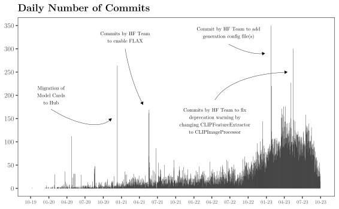
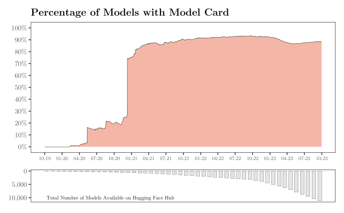
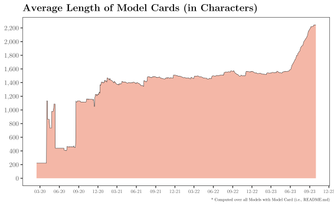
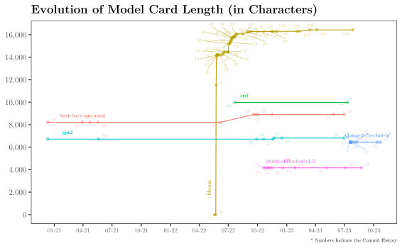
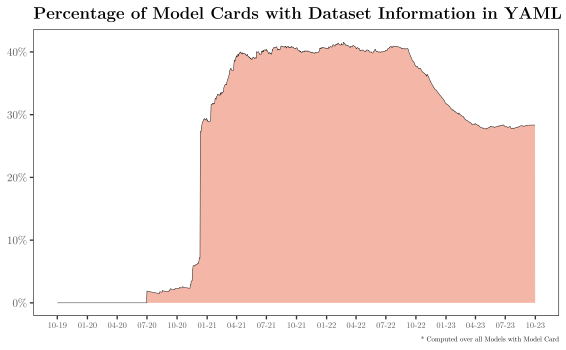
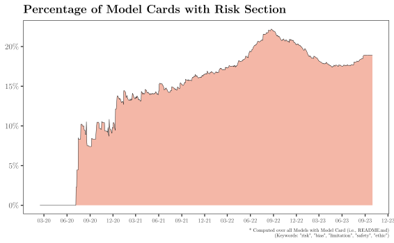
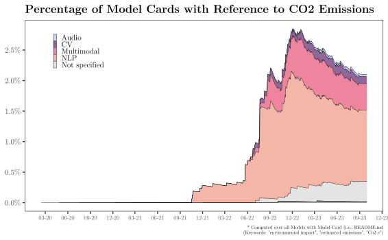

# Preliminary Evidence on AI Transparency

## Transparency Issues and Regulation

Transparency is a key issue surrounding today’s top performing AI
models. In a [recent survey](https://arxiv.org/abs/2310.12941) of ten
major AI foundation model foundries, Stanford researchers find that the
current disclosure practices of primarily closed model providers (i.e.,
those that expose their models via APIs) leave much room for
improvement. Commonly cited transparency gaps relate to intellectual
property, labor practices, energy use and emissions, user statistics and
geographic distribution, as well as bias and safety, often citing
competitive disadvantages or societal threads in the event of full
disclosure. Importantly, the researchers find that providers of open
models (i.e., those that publish full model weights) are consistently
more forthcoming with their disclosures.

By the end of 2023, various legislators are calling for, discussing, or
have even enacted regulations to increase transparency around the
training and deployment of AI models. In the EU, the trilogue recently
reached an agreement on the [2021 EU AI
Act](https://eur-lex.europa.eu/legal-content/EN/TXT/HTML/?uri=CELEX:52021PC0206),
which proposes a risk-based approach to AI regulation that focuses on
regulating applications rather than specific models. Specifically,
high-risk AI systems will have to be registered in a central database
and accompanied by disclosures (in digital format) about their
characteristics, capabilities and limitations, including their intended
purposes, cybersecurity-related issues, potential misuse and
implications for health and safety or fundamental rights, performance in
relation to specific user groups, and training and evaluation datasets.
A [major point of
discussion](https://www.euractiv.com/section/artificial-intelligence/news/france-germany-italy-push-for-mandatory-self-regulation-for-foundation-models-in-eus-ai-law/)
in the negotiations was the regulation of foundation models, which runs
counter to the principle of risk-based reviews of individual
applications. As part of the discussion, negotiators from France,
Germany, and Italy proposed self-regulation through the use of model
cards for foundation model foundries to meet minimum transparency
standards. These should report on capabilities, number of parameters,
intended uses, potential limitations and biases, and red-teaming
exercises. On the other hand, the U.S. recently enacted the [President’s
Executive Order on
AI](https://www.whitehouse.gov/briefing-room/presidential-actions/2023/10/30/executive-order-on-the-safe-secure-and-trustworthy-development-and-use-of-artificial-intelligence/),
which takes a more lenient approach to AI regulation. For example, it
requires the major foundation model foundries to notify the government
about safety assessments prior to a new major model release if that
model exceeds a yet-unrivaled threshold of compute (i.e., it is mostly
targeted at future releases). In addition, the White House has [secured
voluntary
commitments](https://www.whitehouse.gov/briefing-room/statements-releases/2023/07/21/fact-sheet-biden-harris-administration-secures-voluntary-commitments-from-leading-artificial-intelligence-companies-to-manage-the-risks-posed-by-ai/?utm_source=pocket_reader)
from eight firms (Adobe, Cohere, IBM, Nvidia, Palantir, Salesforce,
Scale AI, Stability) to share information on best practices for managing
AI risks. The first binding legislation, in turn, may come from a
[bill](https://beyer.house.gov/uploadedfiles/ai_foundation_model_transparency_act_text_118.pdf)
recently proposed by two U.S. representatives, the “AI Foundation Model
Transparency Act of 2023”, wich aims to require foundation model
creators to disclose extensive information about their training data
(including size, sources, and labeling practices). Taken together, AI
regulation must walk a fine line between regulating AI models versus AI
applications, and closed versus open model providers.

## Model Cards for Model Reporting

As previously noted, [model cards](https://arxiv.org/abs/1810.03993)
represent a well-established, standardized approach to increasing
transparency around the release of AI models. They present an artifact
that summarizes key information related to the use training, testing,
and deployment of the model (e.g., intended use, parameters,
limitations, safety and risk, training and evaluation details,
environmental impact, citation, licensing information, code snippets for
getting started, etc.).[1]

While the major AI foundries publish model cards or less structured
information about their AI offerings on their corporate websites, the
[Hugging Face Model Hub](https://huggingface.co/models) has emerged as
an important repository of models and, in particular, model cards.
Advanced by the open source community, it serves as a „GitHub for
Machine Learning”.

## Some Empirical Evidence on Transparency

The following section presents some empirical evidence on the state of
AI transparency, as proxied by the extent of model card disclosures on
the Hugging Face Face Hub.

#### Data

The underlying data includes the full history of commits and model cards
through 2023-09-30 for all repositories with at least 3 likes (as of November 2023). The full commit histories (including the available
model cards) have been scraped from the Hugging Face Hub. All model card
features are extracted using Regex. Like statistics are retrieved via
the public Hub API.

#### Hub Activity

The figure below shows the commit activity of users on the Hub.[2]
Several days feature a relatively large number of commits, mostly due to
commits from the Hugging Face core team that affect a large number
(possibly all) of the existing models. One important day is December 12,
2021, when model cards [were
migrated](https://discuss.huggingface.co/t/announcement-all-model-cards-will-be-migrated-to-hf-co-model-repos/2755)
from the `transformers` repository to each model’s individual repo on
the Hugging Face Hub.

Note that commit activity increases markedly around September/October
2022, which roughly coincides with the release of the `Stable Diffusion`
model and later `ChatGPT`.

#### Dimensions of Transparency

The following series of plots illustrates the evolution of model cards
over the past three years. They provide descriptive evidence of the
state of AI transparency by illustrating the percentage of all models
with model cards, as well as the evolution of certain model card
features, i.e., the average length and percentage of model cards that
include dataset, risk, or emissions information.

Note that since the model card migration in December 2020, the share of
model repositories with an existing model card (i.e., `README.md` file)
remains slightly below 90% (top panel), regardless of the total number
of available models on the Hub (bottom panel). However, starting around
mid-2023, model cards became increasingly longer, which may (or may not)
be due to the [introduction](https://huggingface.co/blog/model-cards) of
the Model Card Creation Tool, updated model card templates, and the
Model Card Guide Book on December 20, 2022 , which potentially lowered
the barrier to creating informative model cards for machine learning
models. When zooming in on a few select repositories, anecdotal evidence
suggests that the amount of textual, non-code disclosure per model card
changes little after the initial finalization of the `README.md` file.

The next three plots show the prevalence of dataset, risk, and emissions
information in uploaded model cars. About 30% of all model repositories
contain training data information in the model car `YAML` header (down
from 40% in 2021 and 2022). While risk information is among the most
requested information not only by regulators but also by [users of the
Hugging Face
Hub](https://huggingface.co/docs/hub/model-cards-user-studies), the
percentage of model cards with a risk, bias, or safety section has
increased from 10% to only 15-20% over the past three years.[3] Further,
only about 2-3% of models mention keywords related to GHG emissions in
their model cards.[4] Thus, even though researchers have provided ample
[evidence](https://arxiv.org/abs/1910.09700) on and
[tools](https://codecarbon.io/) to track the environmental impacts of
model training and deployment since 2019, the actual provision of
corresponding disclosures has not gained much traction until recently.
Emissions information is mostly provided for NLP models, even though a
[recent study](https://arxiv.org/abs/2311.16863) finds that image tasks
are significantly more energy-intensive than text-based tasks.

#### Potential Benefits of AI Transparency

Note that the statistics and comments presented below are systematically
biased toward open source models, since these are the models that are
openly available through the Hugging Face Hub.[5] First, to get an
intuition of the rise and demise of some of the most popular open source
models, the following animation lists the top 20 models according to the
number of likes on the Hub over time. The Like feature was introduced to
the Hub on July 30, 2021, and its use is limited to users with a
registered account.

In order to measure the beneficial effects of transparency for the model
creator, the final analysis uses fixed effects regressions to correlate
various transparency features with the number of likes. While the number
of users, downloads, or citations would potentially provide more
reliable proxies of model dissemination and popularity, the number of
likes is the only proxy that can be readily extracted from the Hub using
a publicly exposed API (as of November 2023).

<table style="width:100%;">
<colgroup>
<col style="width: 42%" />
<col style="width: 14%" />
<col style="width: 14%" />
<col style="width: 14%" />
<col style="width: 14%" />
</colgroup>
<thead>
<tr class="header">
<th></th>
<th style="text-align: center;">(1) Likes</th>
<th style="text-align: center;">(2) Likes</th>
<th style="text-align: center;">(3) Likes</th>
<th style="text-align: center;">(4) Likes</th>
</tr>
</thead>
<tbody>
<tr class="odd">
<td>____________________________</td>
<td style="text-align: center;">_________</td>
<td style="text-align: center;">_________</td>
<td style="text-align: center;">_________</td>
<td style="text-align: center;">_________</td>
</tr>
<tr class="even">
<td>Log(1+Text_len)</td>
<td style="text-align: center;">4.858***</td>
<td style="text-align: center;"></td>
<td style="text-align: center;"></td>
<td style="text-align: center;"></td>
</tr>
<tr class="odd">
<td></td>
<td style="text-align: center;">(4.935)</td>
<td style="text-align: center;"></td>
<td style="text-align: center;"></td>
<td style="text-align: center;"></td>
</tr>
<tr class="even">
<td>Log(1+Code_len)</td>
<td style="text-align: center;"></td>
<td style="text-align: center;">4.583***</td>
<td style="text-align: center;"></td>
<td style="text-align: center;"></td>
</tr>
<tr class="odd">
<td></td>
<td style="text-align: center;"></td>
<td style="text-align: center;">(2.787)</td>
<td style="text-align: center;"></td>
<td style="text-align: center;"></td>
</tr>
<tr class="even">
<td>Risk Section = TRUE</td>
<td style="text-align: center;"></td>
<td style="text-align: center;"></td>
<td style="text-align: center;">20.201***</td>
<td style="text-align: center;"></td>
</tr>
<tr class="odd">
<td></td>
<td style="text-align: center;"></td>
<td style="text-align: center;"></td>
<td style="text-align: center;">(3.774)</td>
<td style="text-align: center;"></td>
</tr>
<tr class="even">
<td>Emission Info = TRUE</td>
<td style="text-align: center;"></td>
<td style="text-align: center;"></td>
<td style="text-align: center;"></td>
<td style="text-align: center;">21.215***</td>
</tr>
<tr class="odd">
<td></td>
<td style="text-align: center;"></td>
<td style="text-align: center;"></td>
<td style="text-align: center;"></td>
<td style="text-align: center;">(3.095)</td>
</tr>
<tr class="even">
<td>HF Disclaimer = TRUE</td>
<td style="text-align: center;">13.189</td>
<td style="text-align: center;">14.655</td>
<td style="text-align: center;">7.887</td>
<td style="text-align: center;">26.473</td>
</tr>
<tr class="odd">
<td></td>
<td style="text-align: center;">(0.601)</td>
<td style="text-align: center;">(0.652)</td>
<td style="text-align: center;">(0.298)</td>
<td style="text-align: center;">(1.016)</td>
</tr>
<tr class="even">
<td>Commit Number</td>
<td style="text-align: center;">0.079**</td>
<td style="text-align: center;">0.080**</td>
<td style="text-align: center;">0.082**</td>
<td style="text-align: center;">0.083**</td>
</tr>
<tr class="odd">
<td></td>
<td style="text-align: center;">(2.132)</td>
<td style="text-align: center;">(2.177)</td>
<td style="text-align: center;">(2.139)</td>
<td style="text-align: center;">(2.135)</td>
</tr>
<tr class="even">
<td>____________________________</td>
<td style="text-align: center;">_________</td>
<td style="text-align: center;">_________</td>
<td style="text-align: center;">_________</td>
<td style="text-align: center;">_________</td>
</tr>
<tr class="odd">
<td>Repository fixed effect</td>
<td style="text-align: center;">Yes</td>
<td style="text-align: center;">Yes</td>
<td style="text-align: center;">Yes</td>
<td style="text-align: center;">Yes</td>
</tr>
<tr class="even">
<td>Week fixed effect</td>
<td style="text-align: center;">Yes</td>
<td style="text-align: center;">Yes</td>
<td style="text-align: center;">Yes</td>
<td style="text-align: center;">Yes</td>
</tr>
<tr class="odd">
<td>____________________________</td>
<td style="text-align: center;">_________</td>
<td style="text-align: center;">_________</td>
<td style="text-align: center;">_________</td>
<td style="text-align: center;">_________</td>
</tr>
<tr class="even">
<td>VCOV: Clustered</td>
<td style="text-align: center;">by: Repo.</td>
<td style="text-align: center;">by: Repo.</td>
<td style="text-align: center;">by: Repo.</td>
<td style="text-align: center;">by: Repo.</td>
</tr>
<tr class="odd">
<td>Observations</td>
<td style="text-align: center;">567,147</td>
<td style="text-align: center;">567,147</td>
<td style="text-align: center;">567,147</td>
<td style="text-align: center;">567,147</td>
</tr>
<tr class="even">
<td>R2</td>
<td style="text-align: center;">0.858</td>
<td style="text-align: center;">0.858</td>
<td style="text-align: center;">0.858</td>
<td style="text-align: center;">0.858</td>
</tr>
<tr class="odd">
<td>Adj. R2</td>
<td style="text-align: center;">0.855</td>
<td style="text-align: center;">0.855</td>
<td style="text-align: center;">0.855</td>
<td style="text-align: center;">0.855</td>
</tr>
</tbody>
</table>

The results show a significant positive correlation between the number
of likes and various proxies of transparency disclosure, controlling for
fixed differences between repositories (via the repository fixed
effect), constant time trends (via week fixed effects), the commit
number (potentially indicating the age and/or update frequency of the
repository), and the fact that some commits are made by the HF core team
versus the model creator (via the `HF Disclaimer` dummy).

However, the model coefficients provide only descriptive estimates of
the relationship between transparency and model popularity and do not
allow for causal interpretation. For example, transparency may be driven
in a reverse manner by model popularity, with model creators plausibly
having an incentive to increase transparency as more users use the
models and demand additional information.

To allow for a causal interpretation of the investigated effect, it
requires some exogenous mechanism (i.e., treatment) that randomizes
certain model repositories into systematically providing more disclosure
than others. For example:

1.  The proposal of the EU AI Act on April 21, 2021 could potentially
    serve as a treatment mechanism that encourages the large AI firms to
    be more open in their disclosure practices (while decentralized
    model creators may be largely unaffected by the regulation).
    However, since model likes are only available on the Hub starting
    July 2021, a difference-in-differences (DiD) analysis using public
    data is not currently feasible.

2.  The introduction of the Model Card Creation Tool, updated model card
    templates, and the Model Card Guide Book on December 12, 2022 could
    alternatively serve as a treatment for smaller/individual model
    creators. The idea is that the release of these resources will
    systematically facilitate these creators to release more informative
    model cards going forward, which represents an exogenous increase in
    transparency disclosure for these users. However, a preliminary,
    untabulated analysis suggests that model cards are rarely updated
    after their initial completion, so a potential causal effect of AI
    transparency on model popularity would be mainly driven by new
    repositories that provide more extensive disclosures from the start.
    
___

[1] See the [Hugging Face
Docs](https://huggingface.co/docs/hub/model-card-landscape-analysis) for
a comprehensive overview of alternative documentation tools and
proposals.

[2] Note that the analysis omits all repositories by the user
[TheBloke](https://huggingface.co/TheBloke) who is single-handedly
responsible for a large number of repositories (and therefore commits)
that involve quantized LLMs.

[3] A risk section is present if the model card contains a markdown
headline that contains any of the following terms: “risk”, “bias”,
“limitation”, “safety”, or “ethic”.

[4] Emission information are identified by searching for the following
three terms: “environmental impact”, “estimated emissions”, and “Co2 e”.

[5] For exemplary model cards of closed models see, for example, the
[model_card
repository](https://github.com/huggingface/model_card/blob/master/examples.md)
or the websites of the large Foundation model foundries.
