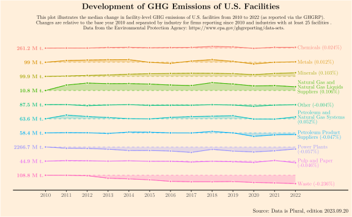

### D.I.P 2024.01.31: Groundwater Levels

See [Newsletter Edition](https://www.data-is-plural.com/archive/2024-01-31-edition/)

  

### D.I.P 2023.09.20: U.S. Facility GHG Emissions

See [Newsletter Edition](https://www.data-is-plural.com/archive/2023-09-20-edition/)

  

